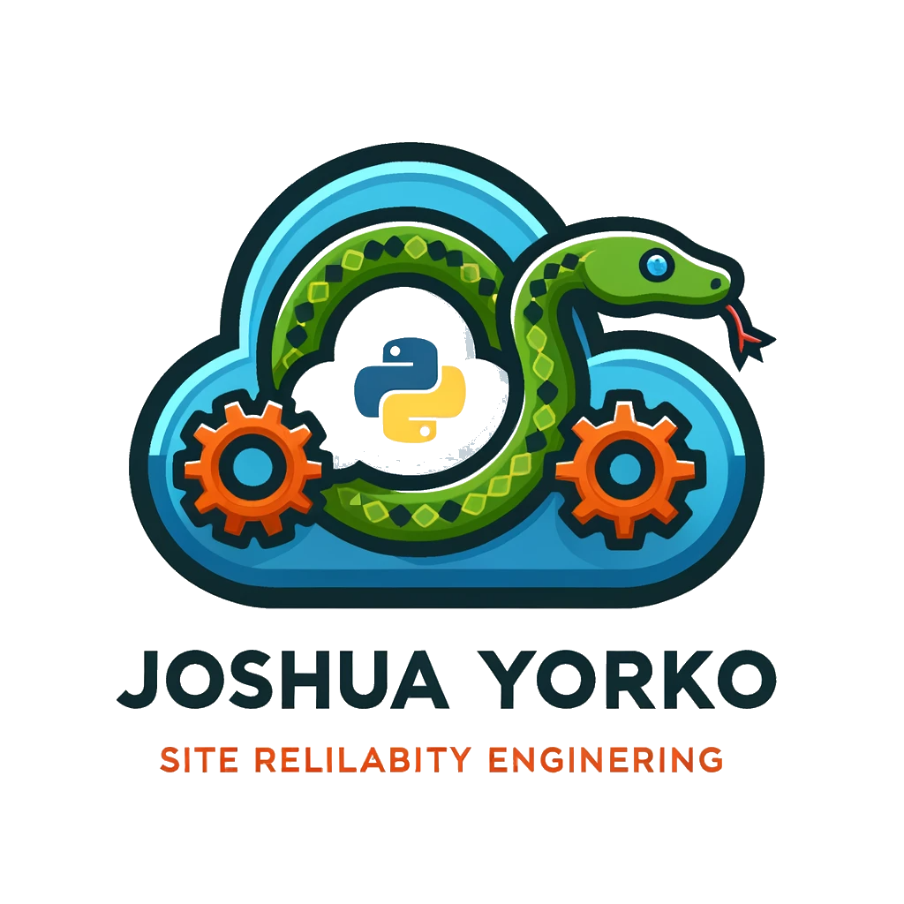

  <h1>Joshua Yorko</h1>

  

## 📍 Info

|  |  |  |
| --- | --- | --- |
|  |  |  |

[Download my resume](assets/JoshYorkoResume.pdf)

## 💼 Skills

| 🛠 **Programming Languages** | Infrastructure & DevOps | Data Engineering |
| --- | --- | --- |
| Python (Expert), Bash, SQL, JavaScript, TypeScript | Terraform, AWS, GCP, CI/CD (GitHub Actions), Rancher, GitOps | Python, Apache Iceberg, DuckDB, Spark, Dremio, Nessie |

| **API Development** | **Virtualization & Containerization** | **GitOps** |
| --- | --- | --- |
| FastAPI, Django API Integration & Management, Microservices Architecture | EC2, Harvester HCI (SUSE), Proxmox, Docker, Kubernetes, K3s, RKE2, EKS | ArgoCD, Flux, Fleet |

| **Full Stack Development** | **Artificial Intelligence** |  |
| --- | --- | --- |
| Django, HTML/CSS, JavaScript, React, Next.js, PostgreSQL, Tailwind, Pocketbase | OpenAI API, AWS BEDROCK, Anthropic, Langchain, Ollama, Llama3 |  |

---

## 📄 Summary

Highly skilled **Site Reliability Engineer** and **Software Engineer** specializing in **SRE**, **Data Engineering**, and **Cloud Computing**. Proven experience in **CI/CD pipelines**, **Kubernetes orchestration**, and **large language model integrations**. Committed to **high availability**, **fault tolerance**, and **efficient resource utilization**.

---

## 👨‍💼 Experience

### 🚀 SOFTWARE ENGiNEER/SRE  
**Gainwell Technologies, Conway, AR**  
*June 2023 ‑ Present*
- Designed and executed CI/CD pipelines using GitHub Actions, streamlining deployment processes for enhanced efficiency.
- Orchestrated containerized application deployment via Kubernetes on AWS EKS, optimizing for auto‑scaling and high availability.
- Developed RESTful APIs with FastAPI and managed their EKS deployment via Terraform, establishing a resilient container environment.
- Automated text extraction in AWS S3 using Amazon Textract and AWS Lambda, centralizing data into a data lake for improved access and analysis.
- Managed AWS infrastructure using Terraform, overseeing services such as EC2, S3, RDS, Elastic Load Balancers, and VPCs.
- Integrated Large Language Models via Amazon Bedrock into data analytics processes for enhanced natural language understanding capabilities.
- Built a microservice images API on FastAPI and Kubernetes to transform deprecated Dental DataClearingHouse APIs into a usable API for frontend UI, delivering clear JSON responses via a custom CDN with PostgreSQL and S3 object store.
- Built an open data lakehouse on EKS with Dremio and Nessie, transforming raw data from an IBM 3270 mainframe into an Apache Iceberg data lake and feeding a Python‑based work distribution algorithm for dental adjudicators.

### 📊 SENiOR DATA ENGiNEER/SOFTWARE ENGiNEER  
**Gainwell Technologies, Conway, AR**  
*June 2022 ‑ March 2023*
- Architected an enterprise‑level data lake utilizing AWS Glue, Amazon S3, PySpark, Hadoop, Python, and PostgreSQL, significantly boosting data processing efficiency.
- Integrated the data lake with Amazon RDS via SQL views for a Django frontend, enabling seamless data access and manipulation.
- Automated complex data retrieval using Python libraries (Requests, aiohttp, asyncio, Selenium, Beautiful Soup), enhancing data acquisition speed and reliability.
- Developed real‑time dashboards in PowerBI and custom visualizations using Plotly and Django, delivering insightful data analytics to stakeholders.
- Ensured high availability and scalability of web applications hosted on Amazon EC2.
- Implemented robust security measures, including SSL encryption and firewalls, to safeguard data and applications.
- Proactively monitored applications and infrastructure, minimizing downtime and maximizing operational reliability.

### 🛠️ IMPLEMENTATiONS SPECiALiST  
**Lambent Spaces, Boston, MA**  
*March 2021 – October 2022*
- Directed software implementations, ensuring customer requirements were met through effective network and system configurations.
- Optimized deployment processes, resulting in heightened efficiency and improved customer satisfaction.
- Fostered collaboration with cross‑functional teams to refine deployment workflows and procedures.
- Authored and utilized SQL and Python scripts for automation and efficient problem resolution.

### 📈 DATA ANALYST (DESKTOP SUPPORT)  
**CVS HEALTH, Cumberland, RI**  
*May 2019 – March 2021*
- Designed and deployed O365 Apps for Enterprise across 80k devices, leveraging Python and Excel for efficient reporting and achieving a 30% increase in deployment efficiency.
- Created and maintained business‑focused reports using Dash/Plotly, SharePoint, and Excel, driving informed decision‑making processes.
- Conducted extensive data normalization from SCCM and Active Directory, ensuring data accuracy and consistency.
- Played a pivotal role in Windows 10 Enterprise Migration, focusing on rigorous testing and quality assurance of developed reports.

### 📋 CLiENT ONBOARDiNG SPECiALiST  
**SPENCER TECHNOLOGIES, Medway, MA**  
*Jan 2017 – Apr 2019*
- Implemented the Smartsheet Request Management System, resulting in annual cost savings of $16k.
- Successfully onboarded new business ventures worth over $15 million, enhancing company growth and market presence.
- Developed and executed project plans for multiple IT projects, leading teams to successful and timely client launches.

---

## 🎓 Education

**B.A. in English**  
**Indiana State University**  
*Aug 2006 – June 2008, Terre Haute, IN*
