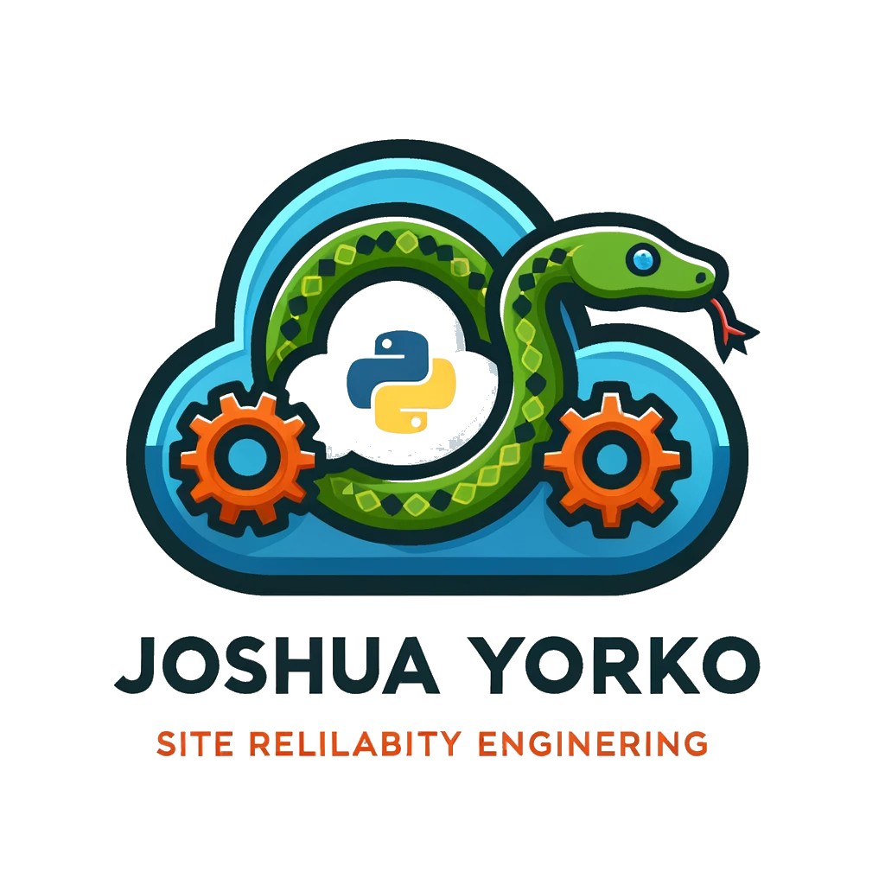

  <h1>Joshua Yorko</h1>

  

## Professional Information

|  |  |  |
| --- | --- | --- |
|  |  |  |

[Download my resume](assets/JoshYorkoResume.pdf)

## Skills

| 🛠 **Programming Languages** | Infrastructure & DevOps | Data Engineering |
| --- | --- | --- |
| Python, Ruby/Rails, SQL, JavaScript/TypeScript, Bash, Go | Kubernetes, Rancher, k3s, Docker, Dev Containers, AWS ECS/Fargate, EKS, Argo CD/GitOps | PostgreSQL, SQL Server, MongoDB, SQLite, DuckDB, pandas, Spark, Iceberg, Dremio, Nessie |

| **Backend & APIs** | **AI & LLM Systems** | **Automation & RPA** |
| --- | --- | --- |
| FastAPI, Rails, Django, REST APIs, PostgreSQL services, integrations, runbooks | RAG, embeddings, vector search, tool-using agents, Amazon Bedrock, Claude/Titan integrations | Robocorp/RCC, UiPath ecosystem, Playwright, API-first automation, CI/CD robots |

| **DevOps & Supply Chain** |  |  |
| --- | --- | --- |
| GitHub Actions, Terraform, Helm, SBOMs, Cosign/signing, multi-arch containers |  |  |

---

## Summary

Advisor-level application developer and senior backend/platform engineer specializing in **AI-enabled automation**, **production APIs**, **data pipelines**, **Kubernetes/cloud-native delivery**, and **enterprise process modernization**. Turns messy business workflows into reliable systems, operational tooling, RAG-style analysis workflows, and measurable toil reduction without overclaiming pilot-stage work.

---

## Experience

### ADVISOR APPLICATION DEVELOPER — BACKEND, DATA & PLATFORM ENGINEERING
**Gainwell Technologies, Conway, AR**  
*June 2023 ‑ Present*
- Promoted into an advisor-level application development role focused on production internal systems, backend APIs, data pipelines, platform automation, and business-team operational tooling.
- Designed, built, and maintained the Images API, a production service used daily by dental adjudicators to retrieve claim images from legacy clearinghouse sources; improved reliability, maintainability, and process visibility for [daily users] and [daily image volume].
- Built Gabby Call Intents analysis workflows over embedded IVR call transcripts, using RAG-style retrieval, similarity search, and multi-turn tool-using agents to surface containment-breakdown insights for operations teams.
- Aggregated operational reports and SQL data pipelines to support adjudicator workload balancing, load visibility, and process reporting across [team/process scope].
- Modernized automation around the UiPath/RPA ecosystem with Python, Playwright, API-first integrations, runbooks, SOPs, and monitoring concepts to reduce manual toil by [manual hours reduced].
- Prototyped Kubernetes/GitHub Actions runner patterns for scalable automation workloads, including custom runner images, deterministic environments, and CI/CD robot execution concepts.
- Integrated LLMs through Amazon Bedrock-style workflows for analytics and triage use cases while keeping production claims about pilots and proposals explicitly bounded.
- Delivered cloud-native services and data platforms with FastAPI, PostgreSQL, S3, Terraform, Docker, Kubernetes/EKS concepts, Dremio, Nessie, Apache Iceberg, and Python work-distribution algorithms.

## Selected Projects

### AI AUTOMATION & PLATFORM SYSTEMS
**Selected open-source and personal technical work**
*June 2023 ‑ Present*
- **joshyorko/rcc:** Apache-2.0 community fork of Robocorp RCC; builds and releases RCC binaries and demonstrates runtime/tooling depth for reproducible automation environments.
- **yorko-io/control-room:** self-hostable Robocorp-style orchestration platform for work item queues, assets, RCC/Holotree integration, Kubernetes/Helm runtime concepts, and operator-style delivery.
- **Fizzy/Symphony/Codex orchestration:** board-driven agent workflows, worktrees, spec-first automation, and operational handoffs for multi-agent engineering work.

### SENIOR DATA ENGINEER / SOFTWARE ENGINEER  
**Gainwell Technologies, Conway, AR**  
*June 2022 ‑ March 2023*
- Architected an enterprise‑level data lake utilizing AWS Glue, Amazon S3, PySpark, Hadoop, Python, and PostgreSQL, significantly boosting data processing efficiency.
- Integrated the data lake with Amazon RDS via SQL views for a Django frontend, enabling seamless data access and manipulation.
- Automated complex data retrieval using Python libraries (Requests, aiohttp, asyncio, Selenium, Beautiful Soup), enhancing data acquisition speed and reliability.
- Developed real‑time dashboards in PowerBI and custom visualizations using Plotly and Django, delivering insightful data analytics to stakeholders.
- Ensured high availability and scalability of web applications hosted on Amazon EC2.
- Implemented robust security measures, including SSL encryption and firewalls, to safeguard data and applications.
- Proactively monitored applications and infrastructure, minimizing downtime and maximizing operational reliability.

### IMPLEMENTATIONS SPECIALIST  
**Lambent Spaces, Boston, MA**  
*March 2021 – October 2022*
- Directed software implementations, ensuring customer requirements were met through effective network and system configurations.
- Optimized deployment processes, resulting in heightened efficiency and improved customer satisfaction.
- Fostered collaboration with cross‑functional teams to refine deployment workflows and procedures.
- Authored and utilized SQL and Python scripts for automation and efficient problem resolution.

### DATA ANALYST (DESKTOP SUPPORT)  
**CVS HEALTH, Cumberland, RI**  
*May 2019 – March 2021*
- Designed and deployed O365 Apps for Enterprise across 80k devices, leveraging Python and Excel for efficient reporting and achieving a 30% increase in deployment efficiency.
- Created and maintained business‑focused reports using Dash/Plotly, SharePoint, and Excel, driving informed decision‑making processes.
- Conducted extensive data normalization from SCCM and Active Directory, ensuring data accuracy and consistency.
- Played a pivotal role in Windows 10 Enterprise Migration, focusing on rigorous testing and quality assurance of developed reports.

### CLIENT ONBOARDING SPECIALIST  
**SPENCER TECHNOLOGIES, Medway, MA**  
*Jan 2017 – Apr 2019*
- Implemented the Smartsheet Request Management System, resulting in annual cost savings of $16k.
- Successfully onboarded new business ventures worth over $15 million, enhancing company growth and market presence.
- Developed and executed project plans for multiple IT projects, leading teams to successful and timely client launches.

---

## Education

**B.A. in English**  
**Indiana State University**  
*Aug 2006 – June 2008, Terre Haute, IN*
